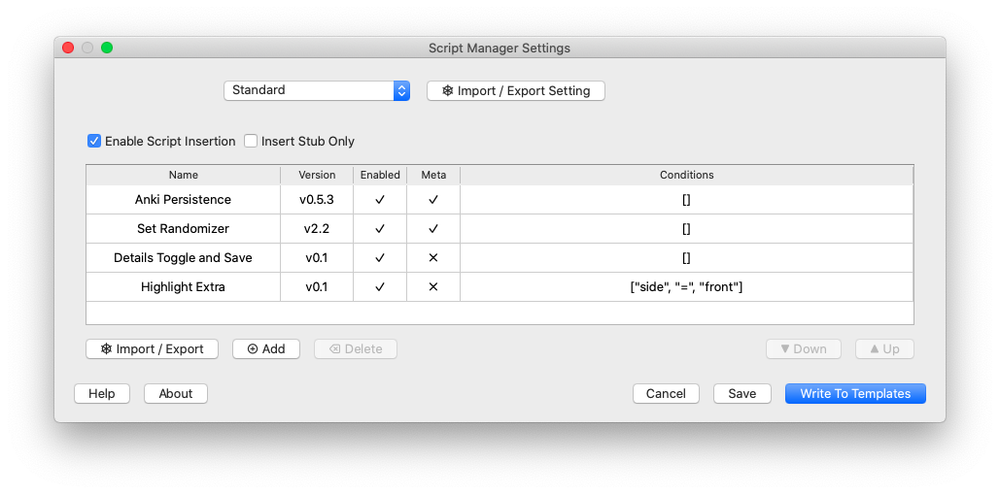
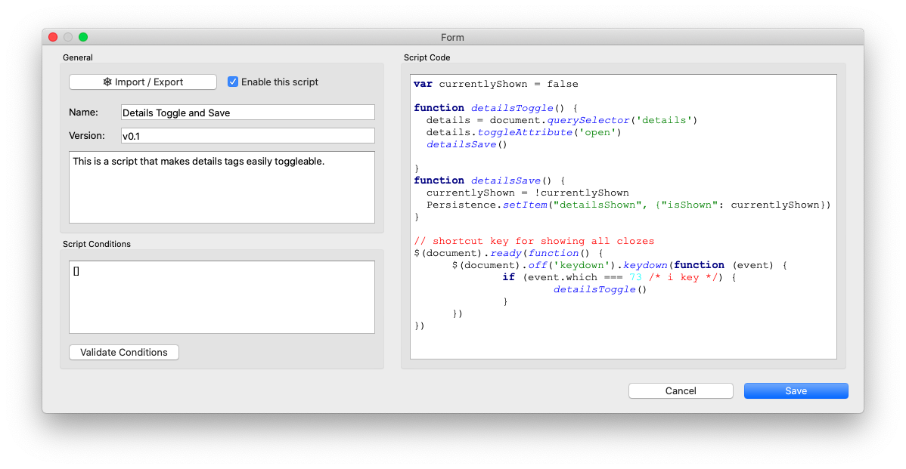

# Anki Script Manager

*Script Manager* makes it easier for you to manage scripts on your note templates.

## Features

1. Easily insert a bunch of scripts into your note templates.
1. Change the code in one place and Script Manager will change the code on all
   templates.
1. Change the order of scripts.
1. Very easy to temporarily exchange your scripts with a stub, to make it easier
   to change the rest of the HTML.
1. Restrict scripts to only be inserted for specific cases. For example only on
   the frontside of your templates, only for specific card types, or only if
   specific tags are present.
1. Offers a hook for you to insert your own script via
   [your own add-on](https://github.com/hgiesel/anki_script_manager/tree/master/example).
   That way you can easily offer your script, give it a name, version it, and update it
   through the AnkiWeb platform.

